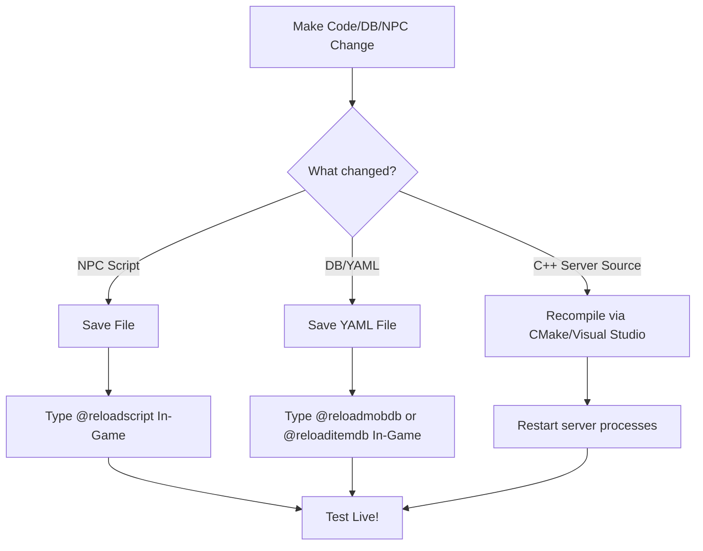

# rAthena Server Maintenance & Development Guide

This guide details the architecture, coding practices, languages, and step-by-step workflows required to maintain and expand your server-side **rAthena** environment.

---

## 📂 Server Repository Architecture

Your rAthena installation is split into several logical modules. Understanding what each directory does is essential before making any changes.

| Directory | Purpose | Primary Files / Technologies |
| :--- | :--- | :--- |
| `src/` | Core server logic and source code. | C++ (Login, Char, Map servers) |
| `conf/` | Main server configurations (rates, limits, network settings). | Text Configuration files |
| `conf/import/` | User overrides for main configurations. **Edit here.** | Text Configuration files |
| `db/` | Databases for items, monsters, skills, and map attributes. | YAML (`.yml`) |
| `db/import/` | User overrides for databases (custom items, mob stats). **Edit here.** | YAML (`.yml`) |
| `npc/` | Official and custom script files (NPCs, warpers, quests, spawns). | rAthena Scripting Language |
| `sql-files/` | Database tables definition and updates. | SQL (MySQL/MariaDB schema) |
| `tools/` | Build tools, conversion scripts, and map utilities. | C++, Python, Shell scripts |

---

## 🛠️ Essential Skills & Technologies

Before modifying anything, ensure you are familiar with the following components:

### 1. C++17 (Server Source Code)
*   **When it's used:** Modifying base game mechanics, packets, adding new custom script commands, or fixing crashes.
*   **How it compiles:** Generated via **CMake** and compiled using **Visual Studio** (on Windows) or **GCC/Make** (on Linux).
*   **Executables produced:**
    *   `login-server.exe` — Handles account authentication.
    *   `char-server.exe` — Handles character selection, deletion, and database saves.
    *   `map-server.exe` — Runs the main game engine loop (combat, NPCs, player interaction).

### 2. SQL (MySQL/MariaDB)
*   **When it's used:** Managing player accounts, storage, guild lists, auction data, mail, and game logs.
*   **Key tool:** DBeaver, phpMyAdmin, or Laragon's built-in MySQL interface.

### 3. YAML (Database Files)
*   **When it's used:** Defining items, monster statistics, item groups, and skill properties.
*   **Syntax:** Indent-sensitive. Always use spaces, **never** tabs, to avoid parsing errors.

### 4. rAthena Scripting Language
*   **When it's used:** Programming NPC dialogue, warp portals, custom shops, event scripts, and item script actions.
*   **Syntax:** A proprietary C-like scripting engine.

---

## 📑 How to Perform Common Maintenance Tasks

> [!IMPORTANT]
> **The Golden Rule of rAthena Maintenance:** 
> NEVER modify official database or configuration files directly. Always use the `/import/` folders. This allows you to update rAthena (`git pull`) in the future without overwriting your custom additions.

---

### 1. Adding/Editing/Deleting Items

#### Step 1: Server-Side Database
Open [db/import/item_db.yml](file:///d:/Project_ROS/rathena/db/import/item_db.yml) and add your custom item block inside the `Body` section.

```yaml
Header:
  Type: ITEM_DB
  Version: 3

Body:
  - Id: 30001
    AegisName: Custom_Sword
    Name: Legendary Custom Sword
    Type: Weapon
    SubType: 2HandSword
    Buy: 20000
    Sell: 10000
    Weight: 1000
    Attack: 250
    Slots: 4
    Jobs:
      All: true
    Locations:
      Both_Hand: true
    EquipLevelMin: 90
    WeaponLevel: 4
    Script: |
      bonus bStr,10;
      bonus bAtkRate,5;
```

*   **To Edit:** Modify values inside your override block in `db/import/item_db.yml`.
*   **To Delete:** Remove the entry from the import file, or set it to disabled.

#### Step 2: Client-Side Requirements (Mandatory)
Adding an item server-side is not enough. Without client-side assets, your game will crash or display a "Gravity Error". You must edit your Client files:
1.  **Item Info:** Update `System/itemInfo.lub` (inside your Ragnarok client folder) with the exact same `Id`, `AegisName`, English name, sprite name, and description.
2.  **Sprites:** Place the custom `.spr` and `.act` files into `data/sprite/아이템/` (Item) and `data/sprite/악세사리/` (Drop/Equip sprite) in your client's GRF or data folder.
3.  **Textures:** Place the collection and item icons `.bmp` into `data/texture/유저인터페이스/collection/` and `item/`.

---

### 2. Adding/Editing/Deleting NPCs

#### Step 1: Create the Script
Create a new text file inside [npc/custom/](file:///d:/Project_ROS/rathena/npc/custom/), e.g., `npc/custom/my_npc.txt`.

##### Example NPC Script:
```rAthena
// MapName,X,Y,Direction<TAB>script<TAB>NPC Name#UniqueTag<TAB>Sprite ID,{
prontera,150,150,4	script	Custom Healer#my_npc	909,{

	mes "[Custom Healer]";
	mes "Hello! Would you like me to heal you?";
	next;
	if (select("Yes:No") == 2) {
		mes "[Custom Healer]";
		mes "Alright, see you later!";
		close;
	}
	
	percentheal 100, 100;
	specialeffect2 EF_HEAL2;
	mes "[Custom Healer]";
	mes "You are fully healed!";
	close;
}
```

*   **Direction:** Values from 0 to 7 (representing compass directions).
*   **Sprite ID:** Look up job sprites or NPC sprites (e.g., `909` is a female assistant).
*   **Curly Braces `{}`:** Contains the execution logic.

#### Step 2: Load the Script
Open [npc/scripts_custom.conf](file:///d:/Project_ROS/rathena/npc/scripts_custom.conf) and append your script path:
```conf
npc: npc/custom/my_npc.txt
```

#### Step 3: Hot-Reload Scripts Live
You do **not** need to restart the server to update NPC changes. Log into the game with a Game Master (GM) character and type:
```text
@reloadscript
```
This reloads all NPC scripts in real-time, making it easy to test edits instantly.

---

### 3. Adding/Editing/Deleting Monster Spawns

To spawn monsters on maps, you use a special format inside `npc/` files, usually grouped under [npc/mobs/](file:///d:/Project_ROS/rathena/npc/mobs/).

#### Spawn Format:
```rAthena
// MapName,X,Y,RangeX,RangeY<TAB>monster<TAB>Display Name<TAB>MobID,Amount,SpawnDelay1,SpawnDelay2,EventScript
prontera,0,0,0,0	monster	Custom Poring	3001,10,60000,30000,0
```
*   `0,0,0,0`: Random spawn locations across the entire map. Set specific coordinates (e.g. `150,150,5,5`) to restrict spawning to a specific zone.
*   `3001`: The Monster ID (from the monster database).
*   `10`: Spawns 10 monsters.
*   `60000,30000`: Minimum and maximum spawn delay in milliseconds (e.g. respawns in 30 to 60 seconds).

---

### 4. Configuration Changes (Rates, Limits)

To edit base game configurations, use the files in [conf/import/](file:///d:/Project_ROS/rathena/conf/import/).

*   **Exp Rates & Drops:** Edit `conf/import/battle_conf.txt`.
    *   *Example:* Set `base_exp_rate: 1000` (10x rates).
*   **Player Limits:** Edit `conf/import/player_conf.txt`.
    *   *Example:* Change max stat caps, inventory size limits.
*   **Server Name / Network Info:** Edit `conf/import/char_conf.txt` and `conf/import/map_conf.txt`.

---

## 📈 Recommended Development Workflow



### Best Practices to Maintain Git Health
1.  **Keep clean logs:** Keep a `PROGRESS.md` or changelog file on your server to track custom changes.
2.  **Separate custom assets:** Keep client patches (GRF edits) backed up separately from the server files.
3.  **Local Backups:** Always run a quick backup command of your MySQL database before updating your SQL tables.
